# Báo cáo cá nhân — K4-L3A Day 13 Monitoring & LLMOps

> Mỗi học viên hoàn thiện một file duy nhất này. Khi dẫn evidence, dùng đường dẫn tương đối, ví dụ `evidence/07-trace-waterfall.png`.

## 1. Thông tin học viên

- **Họ và tên: Nguyễn Văn Quốc Việt**
- **MSSV: 2A202602973**
- **Lớp:** K4-L3A
- **Repository URL: https://github.com/vietvuivui/K4-L3A-DAY13-NguyenVanQuocViet-2A202602973-Monitoring-LLMOps**
- **Commit SHA cuối:** `abef4790ebadb51452c17ca961cff13bb7173b07` (commit chứa toàn bộ source, config, tests và evidence; commit sau đó chỉ ghi SHA này vào report)
- **Challenge ID:** `day13-k4-l3a-monitoring-llmops-v1`
- **Tên project Langfuse cá nhân:** `day13-k4-l3a-2A202602973`

## 2. Evidence index

Điền đúng đường dẫn tới evidence thực tế. Có thể đổi tên hoặc dùng nhiều ảnh nếu cần.

| Evidence | Đường dẫn |
|---|---|
| Pytest cuối | [evidence/01-pytest.txt](evidence/01-pytest.txt) |
| Log validator | [evidence/02-log-validator.txt](evidence/02-log-validator.txt) |
| Dashboard validator | [evidence/03-dashboard-validator.txt](evidence/03-dashboard-validator.txt) |
| Structured log | [evidence/04-structured-log.png](evidence/04-structured-log.png) |
| PII redaction | [evidence/05-pii-redaction.png](evidence/05-pii-redaction.png) |
| Trace list | [evidence/06-trace-list.png](evidence/06-trace-list.png) |
| Trace waterfall | [evidence/07-trace-waterfall.png](evidence/07-trace-waterfall.png) |
| Trace metadata | [evidence/08a-trace-metadata.png](evidence/08a-trace-metadata.png) (correlation ID, prompt name/version/label), [evidence/08b-trace-generation.png](evidence/08b-trace-generation.png) (model, token, cost, TTFT) |
| Prompt versions | [evidence/09a-prompt-v1.png](evidence/09a-prompt-v1.png), [evidence/09b-prompt-v2.png](evidence/09b-prompt-v2.png) |
| Prompt rollback | [evidence/10a-rollback-before.png](evidence/10a-rollback-before.png) (production = v1) → [evidence/10b-promote-v2.png](evidence/10b-promote-v2.png) (promote v2) → [evidence/10c-rollback-v1.png](evidence/10c-rollback-v1.png) (rollback v1) |
| Dashboard runtime | [evidence/11a-dashboard-latency-errors.png](evidence/11a-dashboard-latency-errors.png), [evidence/11b-dashboard-cost-token-quality.png](evidence/11b-dashboard-cost-token-quality.png) |
| Incident metric | [evidence/12-incident-metric.png](evidence/12-incident-metric.png) |
| Incident log | [evidence/13-incident-log.png](evidence/13-incident-log.png) |
| Incident trace | [evidence/14-incident-trace.png](evidence/14-incident-trace.png) |
| Challenge investigation (output `scripts/investigate.py`) | [evidence/15-challenge-investigation.txt](evidence/15-challenge-investigation.txt) |

Ảnh Langfuse (06–10, 14) chụp trong project cá nhân `day13-k4-l3a-2A202602973`; dòng `scope.attributes.public_key` trong ảnh 08a và 14 đã được che. Ảnh 04, 05, 13 là structured log từ `data/logs.jsonl`.

**Artifact kiểm tra trực tiếp trên repo (không chụp ảnh):**

- SLO và error budget: [config/slo.yaml](../config/slo.yaml); alert: [config/alert_rules.yaml](../config/alert_rules.yaml); runbook: [docs/alerts.md](../docs/alerts.md); dashboard contract: [config/dashboard.yaml](../config/dashboard.yaml).
- Source: [app/middleware.py](../app/middleware.py) (correlation ID), [app/main.py](../app/main.py) (bind context), [app/logging_config.py](../app/logging_config.py) (thứ tự processor), [app/pii.py](../app/pii.py) (PII patterns), [app/agent.py](../app/agent.py) (child observations), [app/tracing.py](../app/tracing.py).
- Công cụ tự viết: [scripts/dashboard.py](../scripts/dashboard.py) (dashboard 6 panel), [scripts/investigate.py](../scripts/investigate.py) (Metrics → Logs → Traces).
- Tests: [tests/test_middleware.py](../tests/test_middleware.py), [tests/test_pii.py](../tests/test_pii.py), [tests/test_agent_prompt_trace.py](../tests/test_agent_prompt_trace.py), [tests/test_dashboard_runtime.py](../tests/test_dashboard_runtime.py), [tests/test_investigate.py](../tests/test_investigate.py) và các public tests trong [tests/](../tests/).
- Lịch sử Git: [commits trên `main`](https://github.com/vietvuivui/K4-L3A-DAY13-NguyenVanQuocViet-2A202602973-Monitoring-LLMOps/commits/main).

## 3. Kết quả kỹ thuật

| Nội dung | Baseline | Kết quả cuối | Nhận xét |
|---|---|---|---|
| `validate_logs.py` | 30/100 (62 records; 60 thiếu required fields/enrichment; 0 correlation ID) | **100/100** (387 records, 191 correlation ID, 0 thiếu field, 0 PII leak) | Baseline chưa làm TODO CP1; sau CP1 mọi log API có `correlation_id` + `user_id_hash`, `session_id`, `feature`, `model`, `env` |
| `validate_dashboard.py` | 6/6 panel hợp lệ | **6/6 panel hợp lệ** | Contract giữ nguyên; dashboard runtime `scripts/dashboard.py` đọc chính contract này (ảnh 11a/11b) |
| `pytest` | 22 passed | **37 passed** | Thêm 15 test: middleware (dùng lại/sinh `x-request-id`, header `x-response-time-ms`, không rò context), PII (CCCD, thẻ, hộ chiếu, text thường), child observations không chứa PII, dashboard runtime, investigate |
| Số traces hợp lệ | Chỉ có root `LabAgent.run`, chưa có child span | **151 trace đầy đủ** root `lab-agent-run` → `retrieval` + `prompt-resolve` + `llm-generate` (tổng 193 trace trong project) | Đếm qua Observations API: 31 trace chỉ có root là từ CP0/CP1 (trước khi instrument); 11 trace `tool_fail` có `retrieval` ERROR và không có generation — đúng hành vi. Ảnh 06: lọc `name:lab-agent-run` |
| Số PII leak | 0 (validator) nhưng scrubber chưa nối vào log | **0** trong log (validator + grep PII giả = 0 dòng) và 0 trong trace | Ảnh 05: input có thẻ/CCCD/điện thoại/email → log toàn `[REDACTED_*]` |
| Latency P95 / TTFT P95 | 1788 ms / 50 ms (P50 571, P99 3943; n=30) | Bình thường: **P95 153 ms** / TTFT P95 50 ms (P50 152; n=22, 08:49–08:59Z). Toàn bộ log gồm cả incident: P95 2656 ms / TTFT 51 ms (n=164) | Tail baseline cao do fetch prompt lỗi (chưa có prompt managed, timeout ~2 s); sau khi tạo prompt và cache, latency ~150 ms. P95 2656 ms đến từ `rag_slow` |
| Retrieval success rate | 100% (30/30) | 93.71% toàn bộ log (164/175); 100% khi không có incident | 11 lỗi `RuntimeError` đều do practice `tool_fail` |

## 4. Logging và PII

- **Cách tạo/nhận và truyền correlation ID:** `CorrelationIdMiddleware` gọi `clear_contextvars()` ở đầu mỗi request để không rò context giữa các request. Nếu client gửi `x-request-id` hợp lệ (`[A-Za-z0-9._-]{1,64}`, chặn log injection) thì dùng lại, ngược lại sinh `req-<8-hex>` từ `uuid4`. ID được `bind_contextvars` nên mọi log trong request đều có `correlation_id`; ID cũng được lưu vào `request.state` để truyền sang `agent.run` và trả lại trong body, header `x-request-id` cùng `x-response-time-ms` (kiểm chứng bởi [tests/test_middleware.py](../tests/test_middleware.py): dùng lại ID hợp lệ, sinh `req-<8-hex>` khi thiếu hoặc ID không an toàn, và request sau không mang `session_id`/`feature` của request trước).
- **Các metadata được ghi vào structured log:** `ts`, `level`, `service`, `event`, `correlation_id`, `user_id_hash` (SHA-256 cắt 12 ký tự, không log `user_id` thô), `session_id`, `feature`, `model`, `env`; event `response_sent` có thêm `latency_ms`, `ttft_ms`, `tokens_in`, `tokens_out`, `cost_usd`, `quality_score`, `tool_name`, `tool_success`.
- **Cách bảo đảm PII được scrub trước khi ghi:** processor `scrub_event` được đăng ký trong structlog **trước** `JsonlFileProcessor` và `JSONRenderer`, nên cả file `data/logs.jsonl` lẫn stdout chỉ nhận dữ liệu đã che. `PII_PATTERNS` che email, thẻ thanh toán, CCCD 12 số, điện thoại VN (`0…`/`+84`, có dấu cách/chấm/gạch) và hộ chiếu VN; thẻ và CCCD được thay trước điện thoại để regex điện thoại không cắt ngang chuỗi số dài.
- **Cách kiểm chứng kết quả:** đổi tên log baseline (số liệu đã ghi ở mục 3; file baseline được xóa trước khi commit vì không cần nộp), reload API, gửi request có `x-request-id: req-cafe1234` kèm số thẻ và số điện thoại → response trả đúng header, log ghi `My card [REDACTED_CREDIT_CARD], phone [REDACTED_PHONE_VN]`. Chạy `load_test.py` + `validate_logs.py` đạt 100/100, 0 PII leak; `pytest` 26 passed tại thời điểm CP1. Evidence runtime: gửi input chứa thẻ, CCCD, điện thoại, email giả (`req-9115d002`) → log chỉ còn `[REDACTED_CREDIT_CARD] [REDACTED_CCCD] [REDACTED_PHONE_VN] [REDACTED_EMAIL]`, và tìm các chuỗi PII giả trong `data/logs.jsonl` cho 0 dòng.

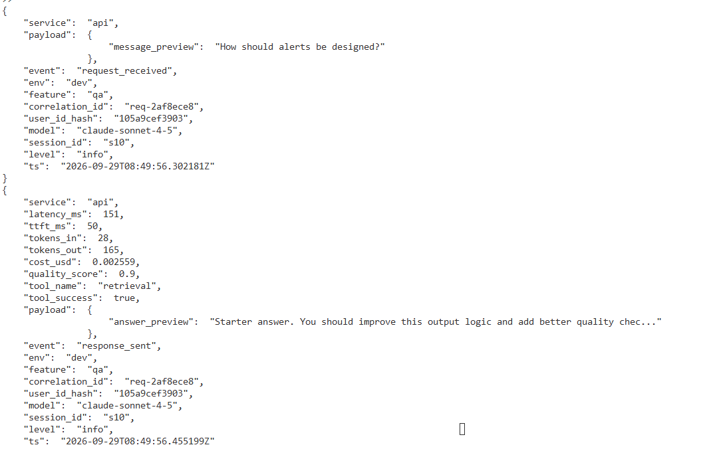

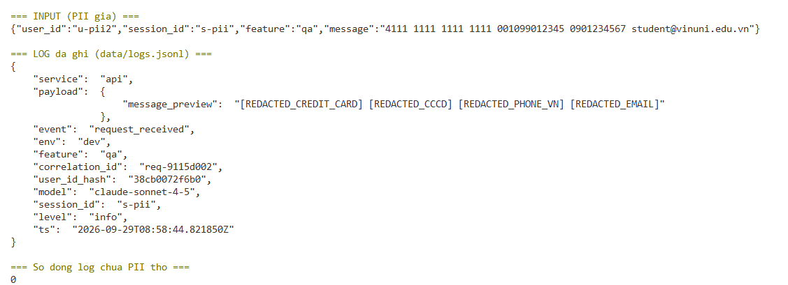

## 5. Tracing và prompt versioning

- **Cách xác nhận traces do chính tôi tạo trong project cá nhân:** `.env` dùng key của project `day13-k4-l3a-2A202602973`; tôi tự chạy `load_test.py` và các request có `x-request-id` do tôi đặt (`req-fa11fa11`, `req-b0000001`...), sau đó tra lại qua Langfuse Observations API v2 bằng chính key đó và tìm thấy trace có metadata `correlation_id` trùng với log.
- **Cấu trúc root/retrieval/generation observations:** root `lab-agent-run` (agent) → `retrieval` (retriever: input `query_preview` đã scrub, output `doc_count`, level ERROR khi vector store lỗi) → `prompt-resolve` (span: prompt name/label/version/source, WARNING khi fallback) → `llm-generate` (generation: model `claude-sonnet-4-5`, liên kết managed prompt, `usage_details` input/output/total, `cost_details` theo giá $3/$15 mỗi 1M token, `completion_start_time` để có TTFT). Trace có user_id đã hash, session_id, environment, tags; metadata có `feature`, `model`, `correlation_id`. Không capture prompt đã compile/answer gốc, chỉ preview đã scrub (đã kiểm tra: không có email thô trong mọi observation). Waterfall ví dụ: retrieval ~1 ms, prompt-resolve 260–530 ms (khi chưa có prompt managed), llm-generate ~155 ms.

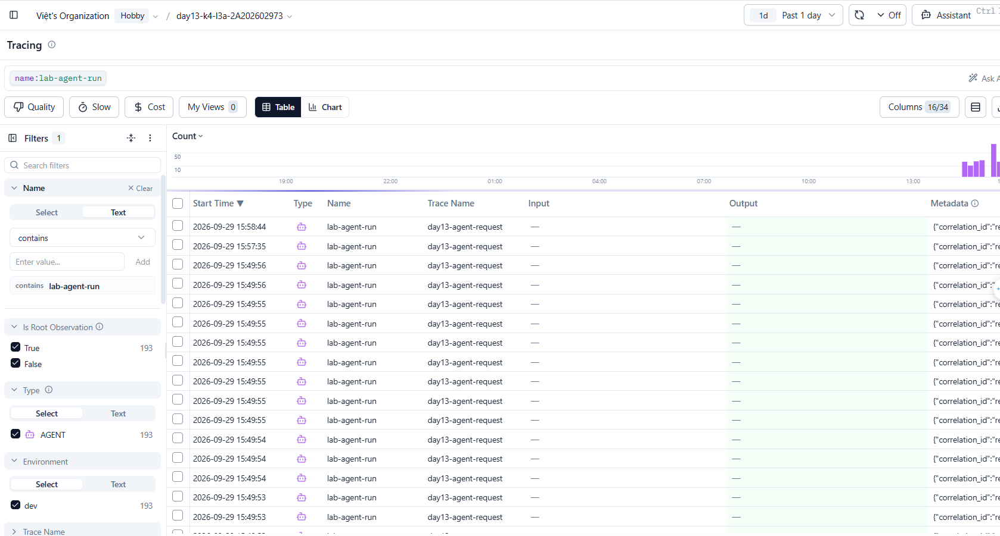

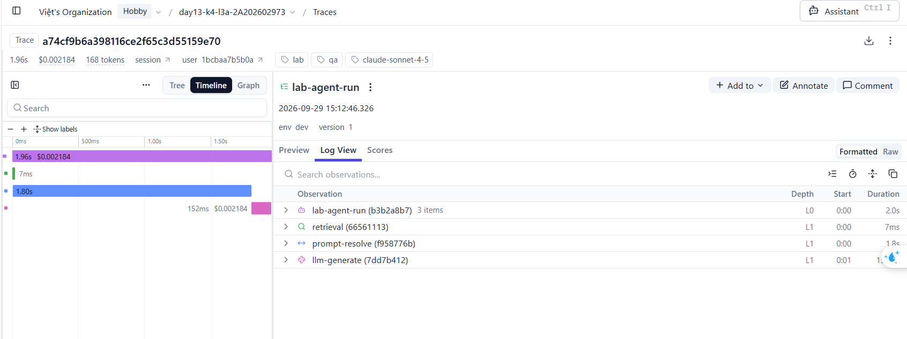

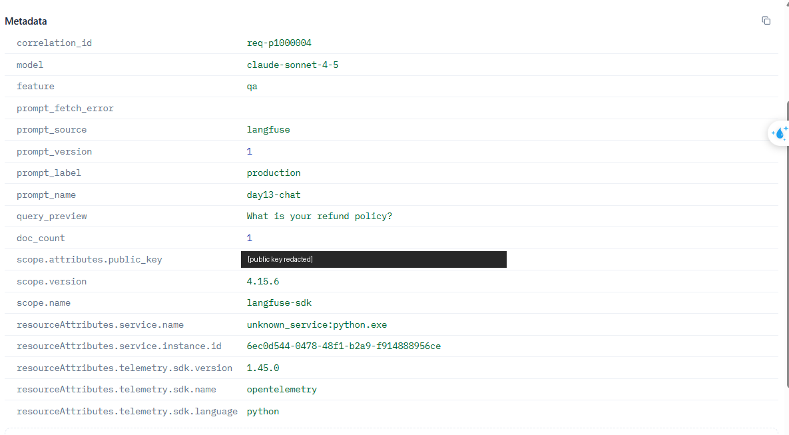

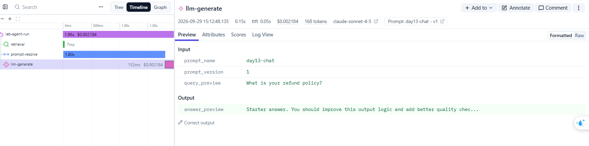
- **Cách nối trace với log:** cùng `correlation_id`. Ví dụ bật `tool_fail`, gửi `x-request-id: req-fa11fa11` → log `request_failed` (`error_type=RuntimeError`, `tool_success=false`, `correlation_id=req-fa11fa11`) → trace `c14f5848aef6…` có metadata `correlation_id=req-fa11fa11`, observation `retrieval` level ERROR `RuntimeError`.
- **Prompt name:** `day13-chat` (text prompt, giữ 3 biến `{{feature}}`, `{{docs}}`, `{{message}}`)
- **Version/label baseline:** version 1, labels `baseline` + `production` — template gốc `Feature=…/Docs=…/Question=…`
- **Version/label candidate:** version 2, label `candidate` — thêm dòng `Answer in at most 3 short bullet points, using only the Docs above.` (cùng input, `tokens_in` 28 → 45)
- **Trace ID của mỗi version:** cùng input `What is your refund policy?`, `feature=qa`:
  - `baseline` → v1: `5334df993f32ae03a1825b871b201305` (`req-b0000001`)
  - `candidate` → v2: `cb2734070d30251402cdb0e7d44ca555` (`req-c0000002`)
  - `production` sau khi promote → v2: `c88fe40b5f592fb77dcc77e958dcd07f` (`req-p2000003`)
  - `production` sau khi rollback → v1: `a74cf9b6a398116ce2f65c3d55159e70` (`req-p1000004`)
  Cả 4 trace đều có `prompt_source=langfuse` và generation liên kết đúng `promptName=day13-chat` / `promptVersion`.
- **Cách promote và rollback `production`:** gán label `production` cho version 2 (`update_prompt(name, version=2, new_labels=["production"])`, tương đương thao tác đổi label trên UI) → Langfuse tự bỏ label khỏi v1 (v1: `baseline`; v2: `production, candidate`). Chạy 1 request với label `production` → trace ghi v2. Rollback: gán lại `production` cho version 1 (v1: `production, baseline`; v2: `candidate`), chạy request → trace ghi v1. Không cần deploy lại code; app chỉ đọc label (lưu ý cache prompt 60 s nên cần chờ hết TTL hoặc khởi động lại API). Các lần đổi label đều dùng SDK (`update_prompt`) trên project cá nhân; ảnh 10a–10c chụp trạng thái label trên Langfuse UI trước khi promote, sau khi promote v2 và sau khi rollback v1.

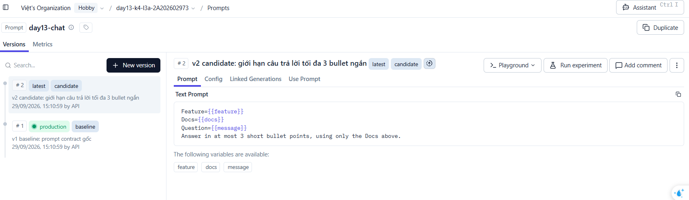

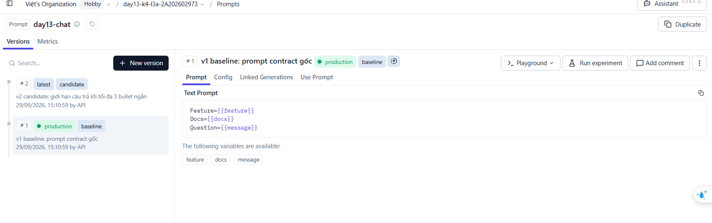

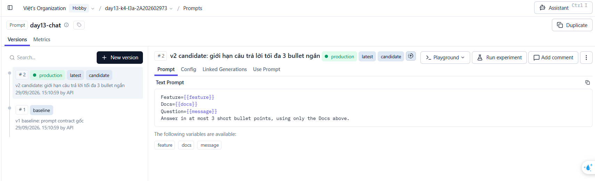

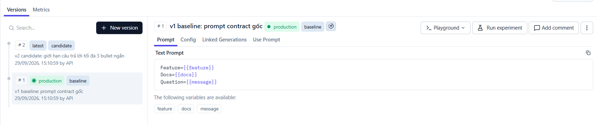

## 6. Dashboard, SLO và alerts

- **Dashboard và sáu panel:** `python scripts/dashboard.py` (http://127.0.0.1:8050; `--print` để in số liệu) — không cần thêm dependency, đọc `data/logs.jsonl` và lấy tên panel, đơn vị, threshold từ `config/dashboard.yaml`. Time range 60 phút, refresh 30 s, mỗi panel có đường threshold đứt nét và badge OK/BREACH: (1) Latency P50/P95/P99 + TTFT P95 (ms, P95 ≤ 3000); (2) Traffic request/phút (≥ 1); (3) Error rate %, breakdown `error_type`, retrieval success % (error ≤ 2%); (4) Cost USD/phút + tích lũy (≤ 2.5); (5) Tokens in/out (≤ 50 000); (6) Quality mean (≥ 0.75). Kiểm chứng runtime với `rag_slow`: latency mỗi request tăng từ ~155 ms lên ~2656 ms, P50 theo phút tăng ~17×; tắt incident sau khi đo. Trục thời gian của dashboard hiển thị giờ UTC. Panel Errors trong ảnh báo BREACH (~6–7%) vì 11 request lỗi từ practice `tool_fail` vẫn nằm trong cửa sổ 60 phút.

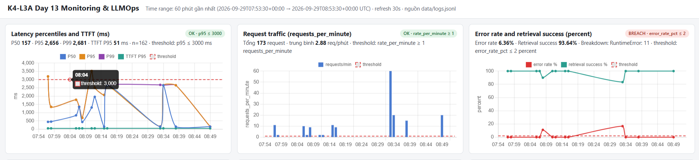

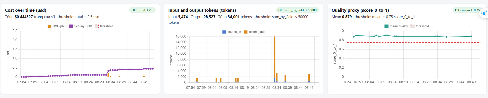
- **SLO và lý do chọn:** ([config/slo.yaml](../config/slo.yaml)) `fast_successful_requests` — 99.5% request (`request_received`) có `response_sent` với `latency_ms ≤ 2000` trong cửa sổ 28 ngày. Tôi hạ ngưỡng từ 3000 ms xuống 2000 ms vì baseline bình thường chỉ ~155 ms (≤ ~2000 ms khi fetch lại prompt), còn `rag_slow` cho ~2656 ms — với 3000 ms SLO không phát hiện được incident này. Contract dashboard giữ threshold 3000 ms theo quy định không tự sửa contract. Hạn chế: `latency_ms` đo trong `LabAgent.run` nên không tính thời gian xếp hàng khi endpoint async bị chặn bởi code đồng bộ (rag_slow + concurrency 5: client chờ ~13 s, log ghi ~2.6 s).
- **Cách tính error budget:** budget = 100% − 99.5% = 0.5%. Theo thời gian: 28 × 24 × 60 = 40 320 phút × 0.5% ≈ 201.6 phút (~3 giờ 22 phút). Theo request: giả định 1 000 request/ngày → 28 000 request × 0.5% = 140 request chậm/lỗi được phép. Burn rate 14.4 trong 1 giờ (bad ratio > 7.2%) tiêu ~2.1% budget → page; burn rate 6 trong 6 giờ (bad ratio > 3%) → Slack/ticket.
- **Ba alert và runbook tương ứng:** ([config/alert_rules.yaml](../config/alert_rules.yaml), [docs/alerts.md](../docs/alerts.md))
  - `high_latency_p95` — P2, P95 `latency_ms` 5m > 2000 ms trong 5m, Slack `#day13-llm-alerts`, runbook [docs/alerts.md#alert-1](../docs/alerts.md#alert-1).
  - `high_error_rate_or_retrieval_failure` — P1, error rate 5m > 2% hoặc retrieval success < 90% trong 3m, Slack `#day13-llm-alerts`, runbook [docs/alerts.md#alert-2](../docs/alerts.md#alert-2).
  - `cost_per_request_spike` — P3, cost trung bình 15m > 0.0035 USD/request (~2× baseline) hoặc > 0.104 USD/giờ trong 15m, Slack `#day13-llm-cost`, runbook [docs/alerts.md#alert-3](../docs/alerts.md#alert-3).
  Owner cả ba: llm-platform-oncall (Nguyễn Văn Quốc Việt). Runbook đi theo Metrics → Logs → Traces và có mitigation (fallback, rollback prompt label, giới hạn token).

## 7. Điều tra challenge

- **Challenge ID:** `day13-k4-l3a-monitoring-llmops-v1` (cohort K4, `affected_feature=monitoring`, `latency_threshold_ms=2000`, 5 queries). File lưu tại `config/challenge.json` (đã `.gitignore`, không commit).
- **Khoảng thời gian điều tra:** 2026-09-29 08:38:39Z → 08:38:54Z (15:38:39–15:38:54 giờ Việt Nam), chạy `python scripts/inject_incident.py` + `python scripts/load_test.py --challenge --concurrency 5`; baseline so sánh là 2 phút ngay trước đó (10 request `qa`/`summary` bình thường). Tắt incident lúc 08:38:54Z.
- **Triệu chứng từ metrics:** panel **Latency percentiles and TTFT**: latency P50 153 → **2654 ms**, P95 1610 → **2655 ms**, vượt SLO 2000 ms (trùng `latency_threshold_ms` của challenge) → alert `high_latency_p95` sẽ kích hoạt. Trong khi đó **TTFT P95 không đổi (50 ms)**, error rate 0%, retrieval success 100%, cost/request 0.0024 → 0.0022 USD, tokens và quality không đổi → vấn đề chỉ là độ trễ, xảy ra *trước* bước LLM. Phía client cả 5 request `monitoring` mất **10.7–13.3 s**. Trên dashboard (trục UTC) tooltip lúc **08:38** cho P50 153 / P95 2655 / P99 2657 ms, TTFT P95 50 ms.

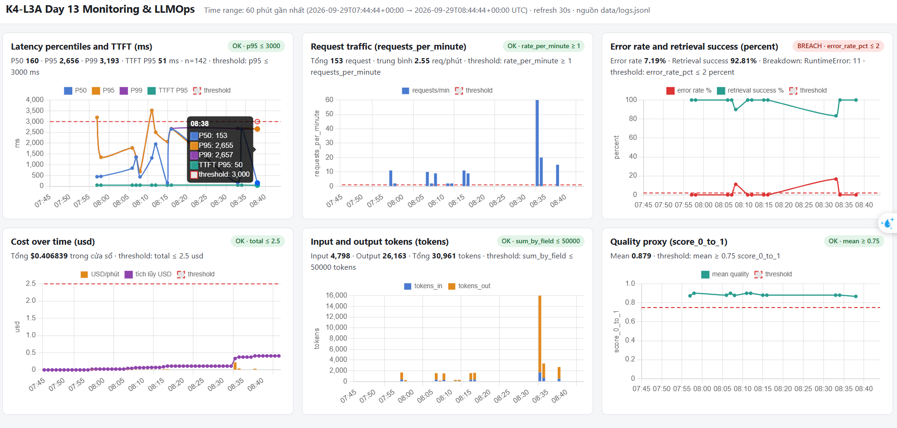
- **Log line và correlation ID liên quan:** `req-804552e0` (session `k4-l3a-challenge-s04`, feature `monitoring`):
  `{"event": "response_sent", "correlation_id": "req-804552e0", "feature": "monitoring", "latency_ms": 2655, "ttft_ms": 50, "tokens_in": 36, "tokens_out": 93, "cost_usd": 0.001503, "tool_name": "retrieval", "tool_success": true, "ts": "2026-09-29T08:38:48.563208Z", ...}`
  Cả 5 request challenge đều có `latency_ms` 2653–2657 ms (`req-84c19ad4`, `req-e0f85419`, `req-804552e0`, `req-fa99e384`, `req-b9bbcab9`), và `response_sent` của chúng cách nhau đều ~2.66 s (08:38:43.2 → 45.9 → 48.6 → 51.2 → 53.9) dù được gửi đồng thời → các request bị xử lý tuần tự.

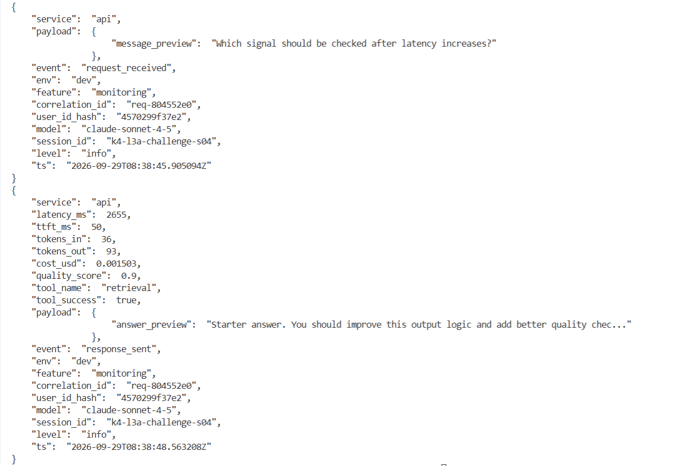
- **Trace ID và span gây ảnh hưởng:** trace `34177cdd91d7de3c34bbaa33fb2cd760` (metadata `correlation_id=req-804552e0`): root `lab-agent-run` 2656 ms → **`retrieval` [RETRIEVER] 2501 ms (94% thời gian)**, `prompt-resolve` 0 ms (prompt cache), `llm-generate` 153 ms (bình thường, TTFT 50 ms, 36/93 tokens, prompt `day13-chat` v1). Không span nào có level ERROR. Toàn bộ output điều tra: [evidence/15-challenge-investigation.txt](evidence/15-challenge-investigation.txt).

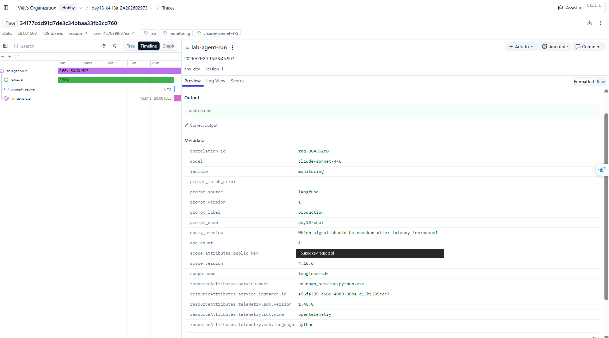
- **Root cause:** bước retrieval (vector store / RAG) chậm ~2.5 s mỗi lần gọi (incident `rag_slow`), làm latency server-side tăng từ ~155 ms lên ~2655 ms. Ba bằng chứng cùng chỉ về retrieval: metric latency tăng nhưng TTFT/token/cost không đổi → log `latency_ms≈2655` với `tool_success=true` (chậm chứ không lỗi) → trace cho thấy `retrieval` chiếm 2501/2656 ms. Tác động bị khuếch đại: `retrieve()` là hàm đồng bộ (`time.sleep`) được gọi trong endpoint `async def chat`, nên nó chặn event loop và 5 request đồng thời phải xếp hàng, người dùng chờ tới 13.3 s trong khi `latency_ms` chỉ ghi 2.6 s.
- **Fix action:** (1) tắt nguồn chậm: `python scripts/inject_incident.py --disable` (thực tế: failover sang vector store replica khỏe / rollback thay đổi index) → latency quay về ~155 ms; (2) đặt timeout cho retrieval (ví dụ 800 ms) và trả fallback “không tìm được tài liệu” thay vì chờ; (3) không chặn event loop: đổi `chat` thành `def` (FastAPI chạy trong threadpool) hoặc gọi `await run_in_threadpool(agent.run, ...)`/client async cho vector store.
- **Preventive measure:** alert `high_latency_p95` (P95 > 2000 ms trong 5 phút, P2) theo SLO 2000 ms; thêm alert/panel riêng cho duration của span `retrieval` để phân biệt RAG chậm với LLM chậm (TTFT); cache kết quả retrieval cho câu hỏi lặp lại; đo thêm end-to-end latency ở middleware/client (bao gồm thời gian xếp hàng) để SLI không đánh giá thấp trải nghiệm người dùng; load test có concurrency trong CI để phát hiện code đồng bộ trong endpoint async.

### Practice trước khi challenge được release (không phải kết quả chính thức)

Chưa nhận `config/challenge.json` nên chỉ chạy practice bằng `--scenario`. Công cụ `python scripts/investigate.py --start <UTC> --end <UTC>` tự đi Metrics → Logs → Traces: so cửa sổ sự cố với cửa sổ baseline ngay trước đó, chọn request bất thường nhất và tìm trace cùng `correlation_id` qua Langfuse Observations API v2.

| Scenario | Metric bất thường | Correlation ID / log | Trace ID và span gây ảnh hưởng |
|---|---|---|---|
| `cost_spike` (08:33:18–08:33:25 UTC) | avg cost/request 0.001959 → 0.007253 USD; avg `tokens_out` 124 → 477 (latency, error không đổi) | `req-40984840`: `response_sent` `tokens_out=720`, `cost_usd=0.010884` | `0033e5a16b756f772350c3cf5966bbe0`: `llm-generate` usage output 720 tokens, cost 0.010884 USD, prompt `day13-chat` v1 (prompt không đổi → nguyên nhân ở phía model/generation) |
| `tool_fail` | error rate 0% → 100% (`RuntimeError` × 10); retrieval success 100% → 0% | `req-25eefd13`: `request_failed`, `tool_name=retrieval`, `tool_success=false` | `a0607725316e276ea99bc824090baf4f`: `retrieval` level ERROR `RuntimeError`, root ERROR `Vector store timeout` |
| `rag_slow` | latency P50 156 → 2654 ms, P95 160 → 2658 ms; TTFT không đổi | `req-7a094e70`: `response_sent` `latency_ms` ≈ 2659 | `6821d4fd192386f52107f16992e2a46d`: `retrieval` 2503 ms / root 2659 ms; `llm-generate` 153 ms bình thường |

## 8. Giải thích và tự đánh giá

- **Một quyết định kỹ thuật quan trọng và lý do:** hạ ngưỡng SLI latency từ 3000 ms xuống 2000 ms dựa trên dữ liệu đo được, thay vì giữ nguyên số mặc định. Khi thử `rag_slow`, mỗi request mất ~2656 ms: với ngưỡng 3000 ms SLO vẫn “xanh” dù người dùng chờ rõ rệt, còn bình thường hệ thống chỉ ~155 ms nên 2000 ms vẫn chừa đủ khoảng cho lần fetch lại prompt. Challenge chính thức sau đó dùng đúng `latency_threshold_ms = 2000`, và SLO này bắt được sự cố. Quyết định thứ hai: không bao giờ gửi prompt đã compile/answer gốc lên Langfuse, chỉ gửi `query_preview`/`answer_preview` đã scrub, vì trace cũng là nơi lưu trữ dữ liệu người dùng.
- **Một lỗi/blocker đã gặp:** sau khi thêm child observations, waterfall có một khoảng trống ~400 ms giữa `retrieval` và `llm-generate` không thuộc span nào, và latency baseline có đuôi dài bất thường (P99 3943 ms) dù fake LLM chỉ mất ~150 ms.
- **Cách tìm nguyên nhân và xử lý:** so sánh duration của root với tổng các child span, đọc metadata root thấy `prompt_source=local-fallback`, `prompt_fetch_error=LangfuseFallback` → khoảng trống là lúc app gọi Langfuse lấy prompt `day13-chat` nhưng prompt chưa tồn tại (timeout ~2 s rồi dùng template local). Tôi thêm span `prompt-resolve` (level WARNING khi fallback) để waterfall không còn “thời gian vô chủ”, rồi tạo prompt v1/v2 trên Langfuse. Sau đó trace ghi `prompt_source=langfuse` và latency bình thường giảm còn P95 ~153 ms. Một blocker khác: API `GET /api/public/traces` trả 410 với organization mới, nên tôi chuyển sang Observations API v2 để kiểm chứng trace bằng code.
- **Cách hiểu luồng Metrics → Logs → Traces:** metrics trả lời *có vấn đề gì và khi nào* (panel Latency: P50 153 → 2654 ms lúc 08:38Z, trong khi TTFT/error/cost không đổi → vấn đề nằm trước bước LLM); logs trả lời *request nào bị ảnh hưởng* (lọc `response_sent` có `latency_ms` cao trong khoảng đó → `req-804552e0`, `tool_success=true` nên là chậm chứ không lỗi); traces trả lời *bước nào gây ra* (trace có cùng `correlation_id` cho thấy `retrieval` chiếm 2501/2656 ms). `correlation_id` là khóa nối log với trace; thiếu nó thì từ một dòng log không thể tìm ra trace tương ứng.
- **Vai trò của prompt version, token/cost, SLO hoặc rollback trong vận hành LLM:** prompt là “code” của ứng dụng LLM nhưng thay đổi ngoài quy trình deploy, nên mỗi trace phải ghi prompt name/label/version để biết câu trả lời nào đến từ prompt nào; label `production` cho phép promote hoặc rollback trong vài giây mà không deploy lại (tôi đã promote v2 rồi rollback v1 và trace ghi đúng version từng lần). Token và cost là chỉ số riêng của LLM: `cost_spike` không làm tăng latency hay lỗi, chỉ lộ ra ở panel Cost/Tokens (cost/request 0.0020 → 0.0073 USD), nên cần alert riêng. SLO + error budget biến “hệ thống có ổn không” thành con số (0.5% ≈ 201.6 phút/28 ngày) để quyết định khi nào phải dừng thay đổi và ưu tiên sửa độ tin cậy.
- **Điều quan trọng nhất đã học:** số đo chỉ đúng với chỗ nó được đo. Trong challenge, log ghi `latency_ms` ~2.6 s nhưng client chờ tới 13.3 s, vì endpoint `async` gọi code đồng bộ làm chặn event loop và các request phải xếp hàng; thời gian xếp hàng không nằm trong bất kỳ span nào. Quan sát tốt phải đo cả phía người dùng (end-to-end), không chỉ trong code của mình.
- **Hạn chế hoặc phần chưa hoàn thành, nếu có:** (1) chưa sửa lỗi chặn event loop (`async def chat` gọi hàm đồng bộ) để không làm thay đổi hành vi challenge — đã ghi trong fix action; (2) `latency_ms` và SLI chưa bao gồm thời gian xếp hàng nên là cận dưới của trải nghiệm thực; (3) alert mới ở dạng cấu hình YAML + runbook, chưa nối Slack/Alertmanager thật; (4) quality score là heuristic, không phải đánh giá chất lượng thật; (5) dashboard tự viết (stdlib + Chart.js), trục thời gian hiển thị UTC; (6) panel Errors trong ảnh báo BREACH do dữ liệu practice `tool_fail` còn trong cửa sổ 60 phút; (7) promote/rollback được thực hiện bằng Langfuse SDK (`update_prompt`) chứ không bấm trên UI; ảnh 10a–10c là trạng thái label trên UI sau mỗi bước; (8) 31 trace đầu tiên (CP0/CP1) chỉ có root vì được tạo trước khi thêm child observations.

## 9. Checklist trước khi nộp

- [x] Kết quả và evidence thuộc commit SHA cuối.
- [x] Tất cả ảnh/output mở được bằng đường dẫn tương đối.
- [x] Incident evidence nối đúng metric → log → trace.
- [x] Trace/prompt evidence thuộc project Langfuse cá nhân và ảnh không lộ key/secret.
- [x] Repository chạy lại được theo README.
- [x] Không có secret, API key, PII thô hoặc evidence của người khác/lớp khác.
- [x] URL repo và commit SHA cuối đã được nộp trên LMS/Codelabs.
